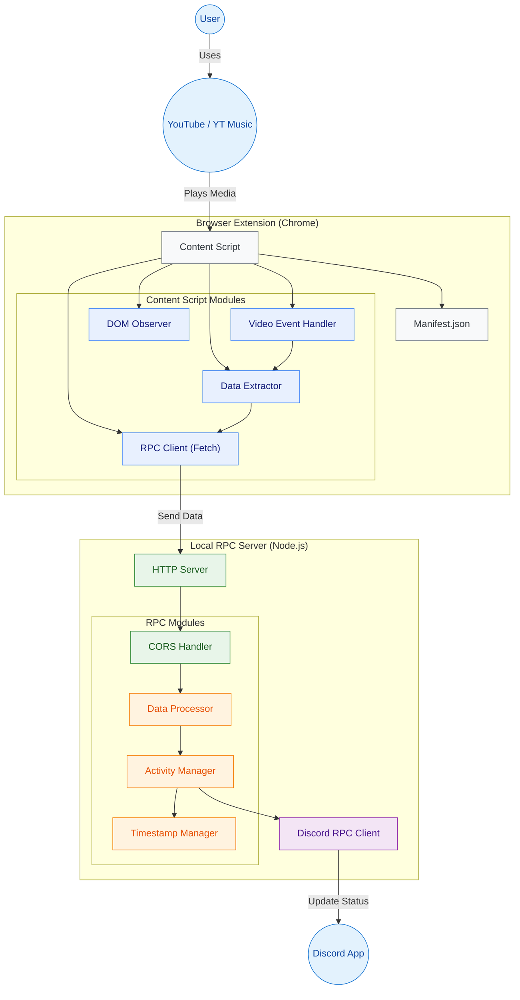

<div align="center">

# YT Music & YouTube Discord Rich Presence

<p>
  <strong>Auto-rich presence status based on what you play on YouTube or YT Music</strong>
</p>


</div>

---

## Features

- Automatically detect playback on:
  - [YouTube Music](https://music.youtube.com/)
  - [YouTube](https://www.youtube.com/)
  - [YouTube Shorts](https://www.youtube.com/shorts)
- Display elapsed and remaining time
- Show album art + play/pause icon
- Use `navigator.mediaSession` or `<video>` events
- Send to local RPC server → updates Discord presence
- One-click `.exe` packaging for background usage

---

## 🚀 Quick Start

<details>
<summary><strong>🔧 1. Setup Discord Application</strong></summary>

1. Go to [Discord Developer Portal](https://discord.com/developers/applications)
2. Create a new application
3. Click **Rich Presence**
   - Upload 3 icons with keys:
     - `ytmusic`
     - `play_icon`
     - `pause_icon`
4. Copy your **Client ID**

</details>

<details>
<summary><strong>🧩 2. Install Chrome Extension</strong></summary>

1. Go to `chrome://extensions/`
2. Enable **Developer Mode**
3. Click **Load unpacked** → select `/extension` folder
4. Open a YouTube / Music / Shorts page
5. You’ll see `✅ Sent Discord status` in DevTools Console

</details>

<details>
<summary><strong>🖥️ 3. Run RPC Server</strong></summary>

```bash
npm install
node rpc-server.js
```

**OR** run packaged executable:

```bash
ytmusic-rpc.exe
```

> This creates a local HTTP server on `http://localhost:3000`

</details>

---

## 📁 Project Structure

```bash
YoutubeStatusDiscord/
│
├─ rpc-server.js           # Main Node.js server
├─ install-service.js      # Optional Windows Service installer
├─ extension/              # Chrome extension source
│   ├─ manifest.json
│   ├─ content.js
│   └─ icon.png
└─ README.md
```

---

## 📊 Architecture Diagram

> 💡 If the diagram doesn't render, [click here to view image](https://github.com/yourname/yourrepo/blob/main/docs/diagram.png)



---

## ✅ Status Checklist

- [x] YouTube Music Support
- [x] YouTube video support
- [x] Shorts Support
- [x] Discord Status Icons/Buttons
- [x] Automatically crawl remaining time
- [x] Use video events to trigger updates (non-polling)
- [x] Can be packaged into .exe background program


---

## 🤝 Credits

Made by **TudoHuang**, powered by Node.js & Web Extension API.  
Discord Rich Presence is based on [`discord-rpc`](https://www.npmjs.com/package/discord-rpc)。
